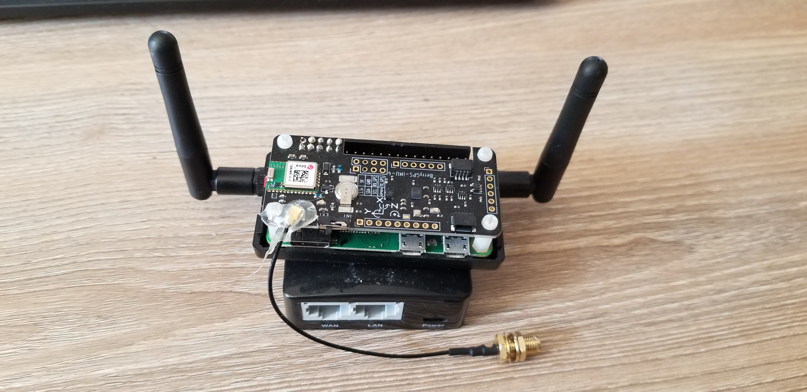
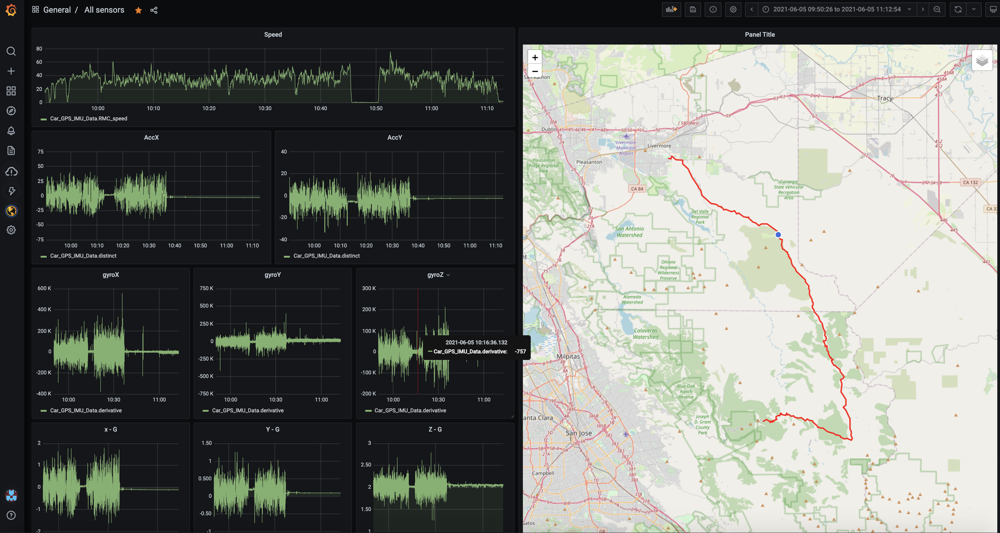
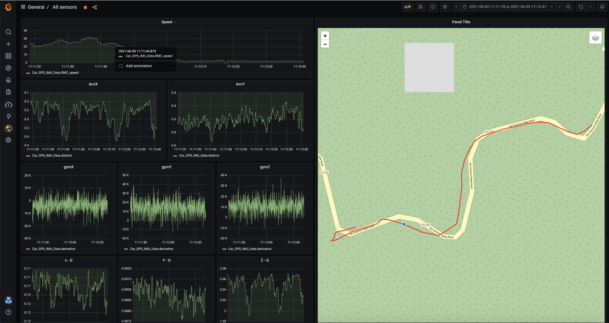

# Pi-Por-Tel 

##### (Noun) A RaspberryPi, BerryIMU-GPS, and InfluxDB based portable telemetry device
##### "use pi-por-tel to talk to your car"

##### So what is pi-por-tel?
It is a portable vehicle telemetry collection device or simply put it logs the sensors attached to this device on to a locally installed timeSeries database. It's hardware based on Rpi zero, inertial measurement unit (IMU) and GPS, with a software stack that uses Python and influxDB

##### What can it do for me?
- You can place it your car to collect race telemetry on the track and analyze it for faster track times. 
- I am using it to see what is my car doing on curvy roads that makes my child car sick.

##### Is it talking to the car using OBDII?
Not at this time, but interfacing OBDII wont be that hard

##### How do you power it?
USB port from my car powers the mini router and then mini-router's USB port powers the device

##### What is this repository for?
This repository focuses on the data collection aspect of the device. The assumption is that the device will be offline and will be continuously collecting data. In another repository, I'll focus on the data synchronization with the central location where it can be analyzed. 

So assemble, clone and go-on!

## Things that you will need

- Raspberry Pi Zero (Chosen because the form factor is small) - https://amzn.to/3nRFF2A 
- Berry IMU GPS - V4 (GPS IMU HAT for RPI) - https://amzn.to/3AtjZxd
- External powered GPS antenna (optional but highly recommended from my experience) - https://amzn.to/2XBlEmg
- Mini router (optional but handy) - https://amzn.to/3hOvk3m

## Hardware Assembly

### It's so simple that this picture should summarize


## Software Installation

### Prepare RPI zero with Buster build (in server mode)
#### - RPI OS Image - you can get it from here https://www.raspberrypi.org/software/operating-systems/#raspberry-pi-os-32-bit 
#### - SD card creation - I used etcher from balena.io 

#### Setup BerryIMU HAT for Raspberry pi

- Follow every step at :  https://ozzmaker.com/berrygps-setup-guide-raspberry-pi/
- while you are in the raspi-config also
  - Enable SSH
  - Enable I2C in the interface
  - Change the power LED to blink on disk activity, crude but handy to see that the sensor data logs are being written

### Install influxdb ver 1.8.5 (Raspberry pi) 
```bash
sudo apt update
sudo apt upgrade -y
wget https://s3.amazonaws.com/dl.influxdata.com/influxdb/releases/influxdb_1.8.5_armhf.deb
sudo dpkg -i influxdb_1.8.5_armhf.deb
sudo systemctl unmask influxdb.service
sudo systemctl start influxdb
sudo systemctl enable influxdb.service
```
### Preparing system 
```bash
sudo apt-get install -y git 
sudo apt-get install -y i2c-tools
sudo apt-get install -y python3-pip
```
### Installing Python Libraries 
```bash
sudo pip3 install pyserial 
sudo pip3 install pynmea2 
sudo pip3 install board 
sudo pip3 install python3-smbus 
sudo pip3 install influxdb
```
## Usage
1. sudo nano /etc/modules 
and add 2 lines
i2c-dev
i2c-bcm2708

2. sudo nano /boot/config.txt
and add
dtparam=i2c_arm=on
dtparam=i2c1=on

3. Clone the repository on your raspberry pi
```bash
git clone https://github.com/vibhubithar/pi-por-tel.git
```
4. Run calibrateBerryIMU.py (optional but important to get better compass heading readings)
```bash
cd ~/pi-por-tel/
python3 calibrateBerryIMU.py

(output will look like this)
magXmin = -1790
magYmin = 2211
magZmin = -828
magXmax = -1745
magYmax = 2243
magZmax = -519
```
5. Paste the results of the step above in the berryIMU-Gforce-TPA-GPS-influx.py file as shown in the section below
```bash
################# Compass Calibration values ############
# Use calibrateBerryIMU.py to get calibration values
# Calibrating the compass isnt mandatory, however a calibrated
# compass will result in a more accurate heading value.

magXmin =  -3924
magYmin =  -125
magZmin =  -1446
magXmax =  289
magYmax =  2633
magZmax =  2242
```
6. Run the command
without tag values for influxdb
```bash
python3 berryIMU-Gforce-TPA-GPS-influx.py
```
OR 
with tag values for influxdb
```bash
python3 berryIMU-Gforce-TPA-GPS-influx.py --trip_type '<trip type on road /water / offroad>' --vehicle_type '<vehcile type SUV>' --brand '<vehicle brand>' --model '<vehicle model>' --seats <number of passengers> --mode '<what mode was the car in comfort/sports>' --logger_location '<location where device was placed>' --owner '<owner of the vehicle>' --tripID <numerical id of the trip> --trip_desc '<description of trip>'
```
## Aggregator setup
Aggregator will be the machine where all the data from the edge node will be stored for further processing. 

I'll use Ubuntu 20.04 for it as installation is simpler and much less prone to failures

```bash
echo "deb https://repos.influxdata.com/ubuntu focal stable" | sudo tee /etc/apt/sources.list.d/influxdb.list
sudo curl -sL https://repos.influxdata.com/influxdb.key | sudo apt-key add -
sudo apt-get install influxdb
sudo systemctl enable --now influxdb
systemctl status influxdb
```
If you would like to use pythin to access the database also install influxDB python libraries
```bash
pip3 install influxdb
```

## The Hub-spoke model for data collection and aggregation


Pi-Por-Tel is designed to collect data offline in a vehicle to keep the system design minimalistic so to say.
Designing it this way reduces the complexities of providing cellular connectivity and other associated complications. See my previous blog on this at https://vibhubithar.medium.com/collecting-vehicle-telemetry-with-pi-por-tel-device-d0d86bf08333

In my design, there are two things involved:

 1. Aggregation node (AN) — this is where all the edge nodes upload their data, could be on edge or cloud
 2. Edge node (EN) — collecting data offline
    
 I aggregate data in four steps as mentioned below:

- Export data on Aggregation node (first instal influxdb and then perform this is step to create a backup of existing data) 
```bash
sudo influx_inspect export -waldir /var/lib/influxdb/wal -datadir /var/lib/influxdb/data -out "influx_backup_aggregationnode.db" -database gpsLogger
```
- Export data on Edge node
```bash
sudo influx_inspect export -waldir /var/lib/influxdb/wal -datadir /var/lib/influxdb/data -out "influx_backup_edgenode1.db" -database gpsLogger
```
- Import data on Aggregation node
```bash
export INFLUX_USERNAME=<your username>
export INFLUX_PASSWORD=<your password>
influx -database gpsLogger -import -path=influx_backup_edgenode1.db
```
- Remove data from the Edge Node
```bash
drop measurement "<measurement name>"
```
The steps above can easily be automated to detect connectivity on the Edge node (wifi in my case) and trigger steps to export data and then remove old data from the Edge node. Once all the Edge nodes have sent data to the Aggregation node run a batch job to import data.

With that being said, what if you are looking for near real-time telemetry then consider the current Edge node’s InfluxDB instance as your buffer. All you have to do is to add connectivity to the Edge node and create batches of data and send them to the Aggregation node

## Outcome of all the hardwork as plotted in grafana
I'll be talking more about the aggregator setup in a separate repository as I dont recommend setting up grafana on the RPI 0




## Contributing
Pull requests are welcome. For major changes, please open an issue first to discuss what you would like to change.

Please make sure to update tests as appropriate.

## License
[MIT](https://choosealicense.com/licenses/mit/)
